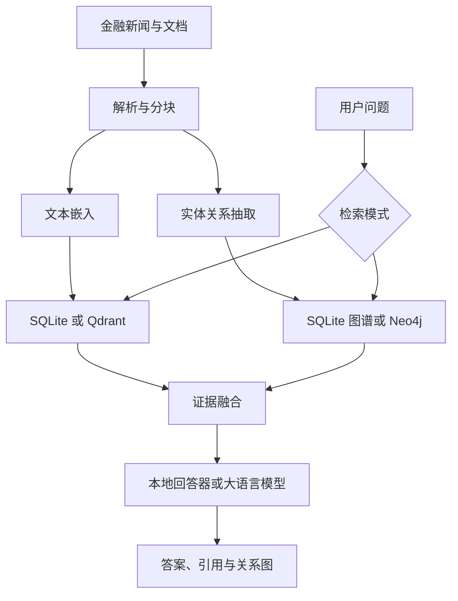

# 毕业项目

## 面向金融新闻的检索增强生成式问答系统

这是一个可本地运行的金融新闻 RAG（Retrieval-Augmented Generation）毕业设计项目。系统支持上传金融新闻、公告、研报与表格材料，完成文档解析、文本分块、向量索引、金融实体关系抽取、向量/图谱/融合检索，并返回带原文证据的回答和方向关系图。

> 本系统用于信息检索和材料整理，不构成投资建议。涉及交易或重大决策时，请核验原文、发布日期和正式公告。

## 功能

- PDF、DOCX、XLSX、CSV、HTML、TXT、Markdown 文档接入。
- 1024 Token 默认分块及 256 Token 上下文重叠。
- 本地 SQLite 向量存储，开箱即用。
- 可选 Qdrant 向量数据库。
- 本地方向知识图谱，支持最多两跳关系检索。
- 可选 Neo4j 图数据库，包含真实写入和路径查询代码。
- 向量检索、图谱检索和 RRF 融合检索。
- 基于发布时间的轻量时效加权。
- 证据编号、文件来源、页码、得分和证据片段展示。
- NetworkX + Plotly 方向关系图。
- OpenAI 兼容接口，可连接 Ollama、vLLM、LocalAI 等服务。
- 无模型服务时使用严格基于证据的离线回答器。
- Gradio 中文界面，主页标题为“毕业项目”。

## 系统流程



## 快速启动

建议使用 Python 3.10 或 3.11。

```bash
python -m venv .venv
source .venv/bin/activate
python -m pip install --upgrade pip
pip install -e .
cp .env.example .env
python scripts/seed_demo.py
python app.py
```

Windows PowerShell 激活环境：

```powershell
.venv\Scripts\Activate.ps1
```

浏览器访问 <http://127.0.0.1:7860>。首次启动后，在“文档索引”页面上传文件，点击“构建知识索引”，再进入“智能问答”。仓库已经提供两份可直接上传的示例材料：

- `data/sample_financial_news.md`
- `data/sample_company_announcement.txt`

## 两种运行方式

### 1. 零外部服务模式

`.env` 保持以下配置：

```dotenv
VECTOR_BACKEND=sqlite
GRAPH_BACKEND=sqlite
EMBEDDING_PROVIDER=hash
LLM_PROVIDER=extractive
```

该模式不需要 Qdrant、Neo4j 或大模型服务，适合答辩演示和功能验证。哈希嵌入及抽取式回答器用于保证离线可运行，不代表生产级模型质量。

### 2. Qdrant + Neo4j 模式

最简单的方式是使用 Docker Compose：

```bash
docker compose up --build
```

服务地址：

| 服务 | 地址 |
|---|---|
| 毕业项目主页 | <http://localhost:7860> |
| Qdrant | <http://localhost:6333> |
| Neo4j Browser | <http://localhost:7474> |

Neo4j 默认账号为 `neo4j`，默认密码见 `docker-compose.yml`。正式部署前必须修改密码。

## 接入本地大模型

下面以提供 OpenAI 兼容接口的模型服务为例：

```dotenv
LLM_PROVIDER=openai
LLM_BASE_URL=http://localhost:11434/v1
LLM_API_KEY=ollama
LLM_MODEL=qwen2.5:7b
```

如需使用远程嵌入接口：

```dotenv
EMBEDDING_PROVIDER=openai
EMBEDDING_BASE_URL=http://localhost:11434/v1
EMBEDDING_API_KEY=ollama
EMBEDDING_MODEL=nomic-embed-text
EMBEDDING_DIMENSIONS=768
```

更换嵌入维度时，请使用新的 `QDRANT_COLLECTION` 名称，避免与旧集合维度冲突。

## 检索模式

| 模式 | 适用问题 | 实现方式 |
|---|---|---|
| 向量检索 | 原文事实、数字、公告内容 | 问题嵌入后执行 Top-K 相似度检索 |
| 图谱检索 | 公司、机构、政策、行业关系 | 从问题实体出发执行方向关系及多跳检索 |
| 融合检索 | 需要原文和关系链的综合问题 | 对向量证据和图谱证据执行 RRF 融合 |

系统会对带发布日期的材料增加小幅时效权重，但不会用发布时间覆盖语义相关性。

## 项目结构

```text
financial_news_rag_project/
├── app.py                         # Gradio 入口
├── src/financial_news_rag/
│   ├── config.py                  # 环境配置
│   ├── parsers.py                 # 多格式文档解析
│   ├── chunking.py                # 文本分块
│   ├── embeddings.py              # 本地及远程嵌入
│   ├── vector_store.py            # SQLite/Qdrant 向量存储
│   ├── graph_store.py             # 实体抽取、SQLite/Neo4j 图谱
│   ├── indexing.py                # 双通道索引流程
│   ├── retrieval.py               # 三类检索与融合
│   ├── llm.py                     # 离线及 OpenAI 兼容模型
│   ├── qa.py                      # Prompt、答案和引用
│   ├── service.py                 # 应用服务层
│   ├── visualization.py           # 方向关系图
│   └── ui.py                      # Gradio 页面
├── data/                          # 示例金融材料
├── tests/                         # 单元与端到端测试
├── scripts/                       # 演示和基准脚本
├── docs/                          # 架构和答辩说明
├── Dockerfile
└── docker-compose.yml
```

## 测试

核心测试不依赖 Gradio、Qdrant 或 Neo4j，可以直接执行：

```bash
python -m unittest discover -s tests -v
```

完整语法检查：

```bash
python -m compileall -q app.py src tests scripts
```

简单检索性能测试：

```bash
python scripts/benchmark.py
```

## 数据与安全

- 默认数据保存在 `runtime_data/`，该目录已加入 `.gitignore`。
- SQLite 模式不会将文档发送到外部服务。
- 配置远程 OCR、嵌入或大模型服务时，应确认文件是否允许离开本机。
- `.env` 不应提交到 Git；仓库只提供不含真实密钥的 `.env.example`。
- 图谱关系由规则或模型抽取，可能存在误识别，关系图不能替代原文证据。

## 二次开发

- 替换实体抽取：实现与 `FinancialEntityExtractor.extract()` 相同的接口。
- 替换嵌入模型：实现 `Embedder.embed()`。
- 替换生成模型：实现 `LanguageModel.generate()`。
- 新增存储后端：实现 `VectorStore` 或 `GraphStore` 协议。

详细设计见 `docs/architecture.md`，答辩演示流程见 `docs/defense-guide.md`。
